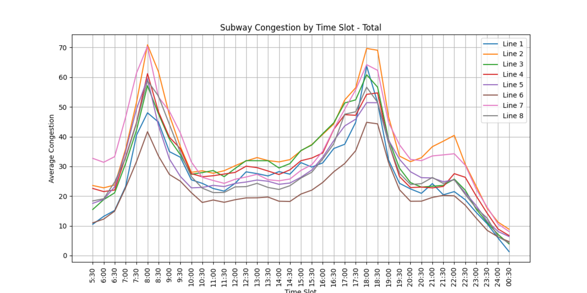
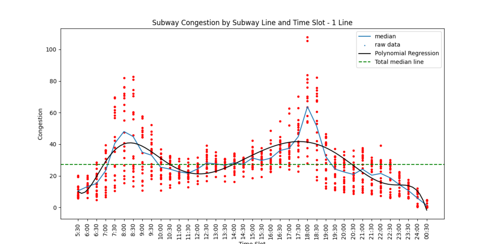

## 🚇 서울 지하철 혼잡도 분석

이 프로젝트는 다항 회귀 분석 모델을 이용하여 선택한 시간의 혼잡도를 예측합니다. 또한 지하철 노선과 시간에 따른 혼잡도를 시각화합니다.

### 📌 사전에 설치해야할 라이브러리 및 csv파일

- csv
- NumPy
- Matplotlib
- sklearn.linear_model
- sklearn.preprocessing
- `Seoulmetro_Congestion_by_station_and_time_zone.csv` (혼잡도 데이터 파일)

### 📋 사용 방법
1. Seoulmetro_Congestion_by_station_and_time_zone.csv 파일을 다운로드하고 스크립트와 동일한 디렉토리에 놓습니다.

2. Python 스크립트를 실행합니다.

3. 요일을 선택하고 지하철 노선을 선택하거나 전체 지하철 시스템에 대한 혼잡 통계를 보려면 0을 입력합니다.

4. 선택 사항에 따라 혼잡도 그래프를 표시합니다.

### ⚙️ 작동 원리
- 스크립트는 CSV 파일에서 데이터를 불러오고 지하철 노선, 요일 및 혼잡 통계와 같은 필요한 정보를 추출합니다.

- 사용자가 특정 날짜와 지하철 노선을 선택하면 스크립트는 해당 노선에 대한 혼잡 데이터를 그래프로 그리고 데이터에 다항 회귀 모델을 맞춥니다.

- 선택한 지하철 노선의 특정 시간에 대한 예상 혼잡도를 계산하고 표시합니다.

### 📜 주요 기능

- 사용자가 선택한 지하철 노선 또는 전체 시스템의 혼잡도(0호선 선택)를 그래프로 시각화합니다.

- 다항 회귀 모델을 사용하여 선택한 시간대의 혼잡도를 예측합니다 : 🌟매우 쾌적, 😊쾌적, 😐보통, 😕혼잡, 😫매우 혼잡

### 📎 참고 사항

- 이 스크립트는 Seoulmetro_Congestion_by_station_and_time_zone.csv 파일이 존재하고 올바르게 포맷되어 있다고 가정합니다.

- 혼잡 데이터에 곡선을 맞추기 위해 다항 회귀를 사용하며, 항상 정확한 예측을 제공하지는 않을 수 있습니다.

### **데이터 출처**  
서울 지하철 공공 데이터 (https://data.seoul.go.kr/dataList/262/S/2/datasetView.do)
